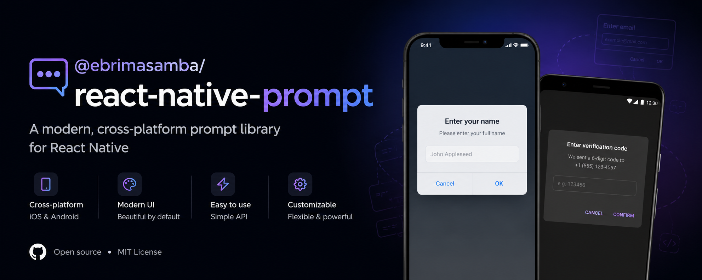

# @ebrimasamba/react-native-prompt

A cross-platform prompt/alert dialog for React Native with support for both the new architecture (TurboModules) and the old architecture (Bridge). On Android it renders a native Material `AlertDialog`; on iOS it delegates to the built-in `Alert.prompt`. No permissions required.

[](https://badge.fury.io/js/%40ebrimasamba%2Freact-native-prompt)
[](https://www.npmjs.com/package/@ebrimasamba/react-native-prompt)



## Features

- ✅ **Cross-platform** - Native `AlertDialog` on Android, `Alert.prompt` on iOS
- ✅ **New & old architecture** - TurboModule (New Arch) with Bridge (Old Arch) fallback
- ✅ **Multiple input types** - plain text, secure (password), and login + password
- ✅ **Custom buttons** - up to 3, with `default` / `cancel` / `destructive` styles
- ✅ **Promise-based API** - `async`/`await` with a fully typed result
- ✅ **Callbacks** - `onConfirm`, `onCancel`, and per-button `onPress`
- ✅ **Android theming** - accent `tintColor` and input placeholders
- ✅ **No permissions required**
- ✅ **Fully typed** - written in TypeScript
- ✅ **Expo compatible** - via a custom dev client / prebuild

## Installation

```sh
npm install @ebrimasamba/react-native-prompt
```

or

```sh
yarn add @ebrimasamba/react-native-prompt
```

### React Native Setup

The library uses autolinking, so no additional setup is required for React Native 0.60+. After installing, rebuild your app so the native module is linked:

```sh
npx react-native run-android
# or
npx react-native run-ios
```

### Expo Setup

This library includes native code, so it does **not** work in Expo Go. Use a [custom dev client](https://docs.expo.dev/develop/development-builds/introduction/):

```sh
npx expo install @ebrimasamba/react-native-prompt
npx expo prebuild
npx expo run:android
# or
npx expo run:ios
```

## Usage

### Basic text prompt

```ts
import { prompt } from '@ebrimasamba/react-native-prompt';

const result = await prompt({
  title: 'Enter your name',
  message: 'We use this to greet you.',
  type: 'plain-text',
  placeholder: 'Name',
  buttons: [
    { text: 'Cancel', style: 'cancel' },
    { text: 'OK', style: 'default' },
  ],
});

if (!result.cancelled) {
  console.log('Hello,', result.text);
}
```

### Secure (password) input

```ts
const result = await prompt({
  title: 'Confirm password',
  type: 'secure-text',
  placeholder: 'Password',
});

if (!result.cancelled) {
  console.log('Password:', result.text);
}
```

### Login + password

```ts
const result = await prompt({
  title: 'Sign in',
  type: 'login-password',
  placeholder: 'Username',
  passwordPlaceholder: 'Password',
});

if (!result.cancelled) {
  console.log(result.text, result.password);
}
```

### Using callbacks

You can pass callbacks instead of (or alongside) awaiting the Promise:

```ts
prompt({
  title: 'Delete item?',
  message: 'This action cannot be undone.',
  buttons: [
    { text: 'Cancel', style: 'cancel' },
    { text: 'Delete', style: 'destructive' },
  ],
  onConfirm: (text) => console.log('confirmed', text),
  onCancel: () => console.log('cancelled'),
});
```

## API Reference

### `prompt(options)`

```ts
function prompt(options: PromptOptions): Promise<PromptResult>;
```

Shows a prompt and resolves with a [`PromptResult`](#promptresult). It also fires the relevant `onConfirm` / `onCancel` / per-button `onPress` callbacks.

### PromptOptions

| Property | Type | Default | Description |
| --- | --- | --- | --- |
| `title` | `string` | — | **Required.** Dialog title. |
| `message` | `string` | — | Optional body text. |
| `type` | [`PromptType`](#prompttype) | `'plain-text'` | Input mode. |
| `defaultValue` | `string` | — | Pre-filled value for the text input. |
| `placeholder` | `string` | — | Hint for the text input *(Android)*. |
| `passwordPlaceholder` | `string` | — | Hint for the password field in `login-password` *(Android)*. |
| `keyboardType` | `string` | — | Keyboard type *(iOS only — passed to `Alert.prompt`)*. |
| `buttons` | [`PromptButton[]`](#promptbutton) | Cancel / OK | Up to 3 action buttons. |
| `tintColor` | `string` | — | Accent color (hex) for the confirm button *(Android)*. |
| `onConfirm` | `(text: string, password?: string) => void` | — | Called when a non-cancel button is pressed. |
| `onCancel` | `() => void` | — | Called when a `cancel`-styled button is pressed. |

### PromptButton

```ts
interface PromptButton {
  text: string;
  style?: 'default' | 'cancel' | 'destructive';
  onPress?: (value?: string, password?: string) => void;
}
```

### PromptType

```ts
type PromptType = 'default' | 'plain-text' | 'secure-text' | 'login-password';
```

### PromptResult

```ts
interface PromptResult {
  cancelled: boolean;
  text?: string;
  password?: string;
  buttonIndex?: number;
  buttonText?: string;
}
```

## Platform Support

- ✅ **Android** - Native Material `AlertDialog` with full feature support
- ✅ **iOS** - Backed by the built-in `Alert.prompt`

> **Note:** `tintColor`, `placeholder`, and `passwordPlaceholder` are Android-only — iOS `Alert.prompt` does not support them. `login-password` styling is also more limited on iOS.

## Requirements

- React Native 0.71+ (supports both new architecture with TurboModules and old architecture with Bridge)
- Android API level 24+ (Android 7.0+)
- Expo SDK 50+ (for Expo compatibility, via a custom dev client)

## Troubleshooting

### Common Issues

**`The 'RNPrompt' native module is unavailable`**

The native module wasn't linked. Make sure you rebuilt the app (not just reloaded JS) after installing — `npx expo prebuild && npx expo run:android`, or `npx react-native run-android`. Expo Go is not supported.

**Options seem to be ignored on iOS**

`tintColor`, `placeholder`, and `passwordPlaceholder` are not supported by iOS `Alert.prompt`. They only apply to the native Android dialog.

**The dialog can't be dismissed by tapping outside**

This is intentional — it matches iOS `Alert.prompt` behaviour. Provide a `cancel`-styled button to let users dismiss it.

### Debug Tips

- Confirm the package appears under your app's native dependencies after a rebuild.
- On Android, verify the new architecture is enabled (`newArchEnabled=true`) if you expect the TurboModule path; the Bridge path works either way.

## Contributing

- [Development workflow](CONTRIBUTING.md#development-workflow)
- [Sending a pull request](CONTRIBUTING.md#sending-a-pull-request)
- [Code of conduct](CODE_OF_CONDUCT.md)

## License

MIT

## Author

**Ebrima Samba**

🔍 Currently seeking remote employment opportunities

[](https://www.linkedin.com/in/ebrima-samba-4923a7169/)
